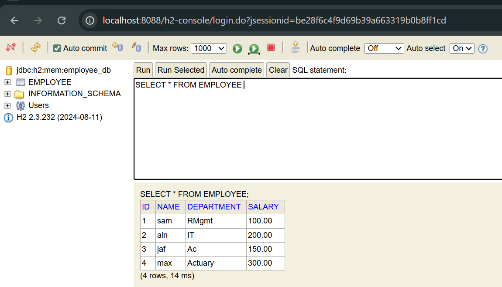
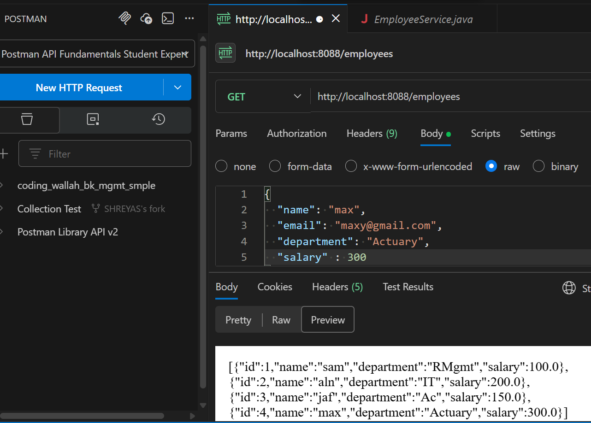
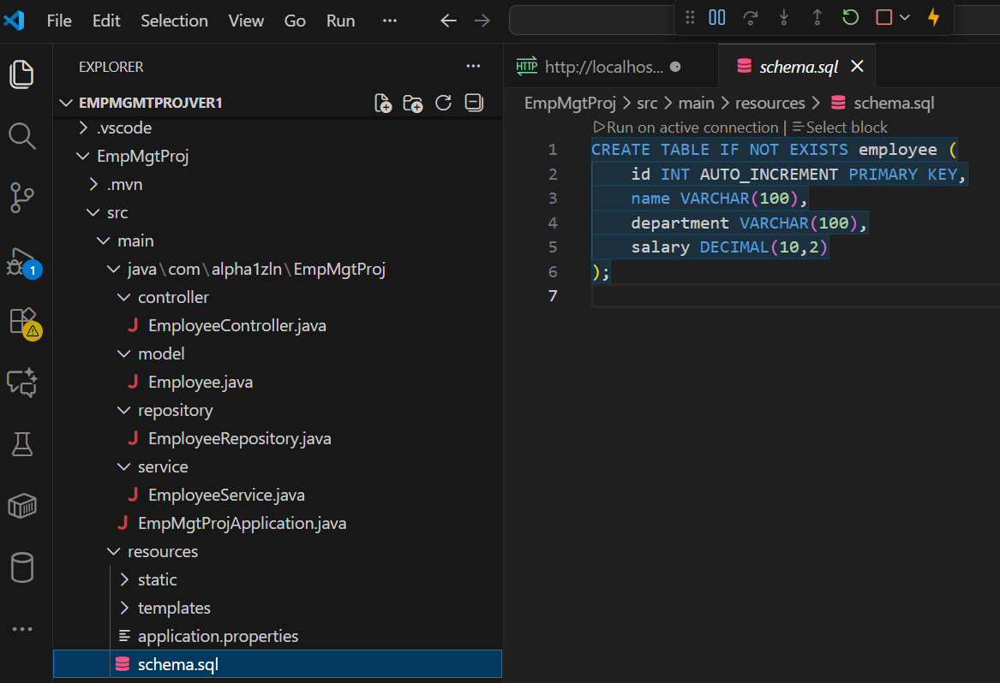

# 📘 ** Employee Management System – Spring Boot (Versioned Project) — **

A complete, version-wise Spring Boot Employee Management System built using best practices such as layered architecture, dependency injection, Spring JDBC / JPA, H2 Database, and REST APIs.
This repository evolves through Version 1 → Version 4, each adding new industry-level features to simulate a real enterprise application.

---

## 🧩 Project Versions

### ✅ Version 1 – Basic CRUD using Spring JDBC + H2

- Spring Boot 3
- REST APIs for Employee CRUD
- Spring JDBC + JdbcTemplate
- H2 in-memory database
- Layered architecture (Controller → Service → Repository)
- schema.sql for DB auto-creation

✔ Purpose: Learn fundamentals of REST APIs, JDBC, DI, and Spring Boot layers.

---

### ✅ Version 2 – Using Spring Data JPA + Validation + Exception Handling

Adds:
- Spring Data JPA (Hibernate ORM)
- Entity mapping with @Entity
- DTO and validation (@Valid, @NotNull, etc.)
- Global exception handler
- Real-world error JSON responses

✔ Purpose: Move from JDBC to professional-level ORM.

---

### ✅ Version 3 – Microservices Architecture (Modularizing the Application)

- Split modules into services:
- Employee Service
- Payroll Service
- Department Service

Adds:
Service-to-Service communication using RestTemplate or WebClient
Centralized configuration
API gateway (optional)

✔ Purpose: Learn real microservices architecture used at Google, Mastercard, Visa, etc.

---

### ✅ Version 4 – Authentication + Authorization (JWT)

Adds:
User registration + login
BCrypt password hashing
JWT token generation + validation
Role-based access (ADMIN, USER)
Protect CRUD routes using JWT

✔ Purpose: Learn secure enterprise-level app development.

---

# 🎯 **Project Ver 1 Overview**

The **Employee Management System** is a multi‑version learning + production‑style Spring Boot project designed to help developers understand:

* 3‑Layer Architecture (Controller → Service → Repository)
* Spring JDBC with H2 Database
* CRUD operations using REST API
* Postman testing
* Database schema execution using schema.sql
* Version evolution from basic → enterprise-level
* Microservices theory
* JWT Authentication theory
* Git branching + GitHub commands

This makes the project suitable for:

* Beginners learning Spring Boot
* Students preparing for interviews
* Developers practicing enterprise project structure

---


---
## 📂 Project Structure (Version 1)


### 🔄 Flow of Project (3-Layer Architecture)
Client → Controller → Service → Repository → H2 DB

Controller Layer
Handles HTTP requests (POST, GET, PUT, DELETE).

Service Layer
Business logic, validations, transformations.

Repository Layer
Database access using JDBC / JPA.

H2 DB
Stores employee records.

---


---


# 🧭 **2. Version Roadmap (v1 → v4)**

| Version                            | Description                                           | Tech Used                                |
| ---------------------------------- | ----------------------------------------------------- | ---------------------------------------- |
| **v1: Basic CRUD**                 | Simple HashMap CRUD (no DB)                           | Spring Boot Core, REST Controller        |
| **v2: CRUD + JDBC + H2**           | Real database + schema.sql + Postman                  | Spring JDBC, H2 DB, Layered Architecture |
| **v3: Microservices-ready Design** | Split into Employee Service, Payroll Service (theory) | REST, Service Registry, Design Patterns  |
| **v4: Authentication + JWT**       | Secure microservices with tokens                      | Spring Security, JWT theory              |

---

---

# 🧱 **3. Architecture — 3 Layer + Flow Diagram**

## **3-Layer Architecture Explanation (Detailed)**

### **① Controller Layer**

* Handles HTTP requests
* Converts JSON ↔ Java Objects
* Calls Service layer

* Handles:
    Routing (GET/POST/PUT/DELETE)
    Request parameters
    Input validation
    HTTP response formatting
    Status codes (200, 201, 404, 500 etc.)

Controller should NOT contain business logic.

### **② Service Layer**

* Contains business logic
* Validates input
* Handles rules like salary validation, department mapping, error handling

* Handles:
    Business rules
    Validation
    Transformations (entity ↔ DTO)
    Calling other services/3rd-party APIs
    Security checks (optional)

This layer makes the app scalable & maintainable.


### **③ Repository Layer**

* Talks to the database
* Executes SQL queries via JdbcTemplate

* Handles:
    CRUD
    Querying DB
    Custom queries
    Transaction handling (mostly automated)
    Spring Data JPA creates most methods automatically.


### Summary Table for Quick Revision

| Layer      | Responsibility      | Knows About |
| ---------- | ------------------- | ----------- |
| Controller | API handling        | Service     |
| Service    | Business logic      | Repository  |
| Repository | Database operations | SQL + DB    |

---

# 🗃️ **4. Project Structure (Production‑Style)**

## 📂 Project Structure (Maven — Spring Boot)
```
project-root/
│
├── src/
│   ├── main/
│   │   ├── java/
│   │   │   └── com.alpha1zln.emp/
│   │   │       ├── controller/
│   │   │       │    └── EmployeeController.java
│   │   │       ├── service/
│   │   │       │    ├── EmployeeService.java
│   │   │       │    └── EmployeeServiceImpl.java
│   │   │       ├── repository/
│   │   │       │    └── EmployeeRepository.java
│   │   │       ├── entity/
│   │   │       │    └── Employee.java
│   │   │       ├── dto/
│   │   │       │    └── EmployeeDTO.java
│   │   │       ├── exception/
│   │   │       │    ├── GlobalExceptionHandler.java
│   │   │       │    └── ResourceNotFoundException.java
│   │   │       └── EmpMgtApplication.java
│   │   │
│   │   ├── resources/
│   │   │   ├── application.properties
│   │   │   ├── schema.sql
│   │   │   ├── data.sql
│   │   │
│   │   └── webapp/ (optional)
│   │
│   └── test/
│       └── EmployeeServiceTest.java
│
├── pom.xml
└── op/     <-- place all screenshots here
    ├── h2.png
    ├── postman.png
    └── structure.png
```

## 📂 src folder structure:
```
src/main/java/com/example/employee/
│
├── controller/
│   └── EmployeeController.java
│
├── service/
│   └── EmployeeService.java
│
├── repository/
│   └── EmployeeRepository.java
│
├── model/
│   └── Employee.java
│
└── EmployeeCrudApplication.java

src/main/resources/
│
├── application.properties
├── schema.sql
└── data.sql  (optional)
```

---

# 🧩5. All Diagrams

## **5a. UML Diagram (ASCII Table Format)**

```
+-----------------------+
|     Employee          |
+-----------------------+
| id: int               |
| name: String          |
| department: String    |
| salary: double        |
+-----------------------+

        ▲
        |
        |
+------------------------+
|   EmployeeRepository   |
+------------------------+
| + save(emp)           |
| + findAll()           |
| + findById(id)        |
| + update(emp)         |
| + delete(id)          |
+------------------------+

        ▲
        |
+------------------------+
|   EmployeeService      |
+------------------------+
| + addEmployee()        |
| + getAll()             |
| + getEmployee(id)      |
| + updateEmployee()     |
| + deleteEmployee()     |
+------------------------+

        ▲
        |
+------------------------+
|   EmployeeController   |
+------------------------+
| + POST /employees      |
| + GET /employees       |
| + GET /employees/{id}  |
| + PUT /employees/{id}  |
| + DELETE /employees/{id}|
+------------------------+
```


## ⭐ 5b. SEQUENCE DIAGRAM (with theory)

Sequence diagram shows flow of a request between system components.

User → Controller → Service → Repository → DB → back upward

```
ASCII UML
User
 |  sends GET /employees
 v
Controller ------------------------------+
 | calls service.getAllEmployees()      |
 v                                       |
Service ---------------------------------+
 | calls repository.findAll()           |
 v                                       |
Repository ------------------------------+
 | executes SQL                          |
 v                                       |
Database                                 |
 | returns results                       |
 ^                                       |
 | repository returns List<Employee>     |
 ^                                       |
 | service returns List<Employee>        |
 ^                                       |
 | controller returns JSON response      |
 ^                                       |
User receives JSON ----------------------+

```

#### Theory (easy explanation)
    Controller handles the HTTP call.
    Service applies logic (sorting, rules, validation).
    Repository interacts with DB.
    DB stores persistent data.
    Response follows same chain backward.


## ⭐ 5c. COMPONENT DIAGRAM

Shows major building blocks in a Spring Boot project.
```
+------------------------+
|   Controller Layer     |
|  (REST Controllers)    |
+-----------+------------+
            |
            v
+------------------------+
|     Service Layer      |
| (Business Logic Beans) |
+-----------+------------+
            |
            v
+------------------------+
|   Repository Layer     |
| (JPA Interfaces)       |
+-----------+------------+
            |
            v
+------------------------+
|        Database        |
|   H2 / MySQL / etc     |
+------------------------+
```

## ⭐ 5d. DEPLOYMENT DIAGRAM

Shows how your app runs in real world.

```
+----------------------------------------+
|          User Browser/Postman          |
+--------------------+-------------------+
                     |
                     v  HTTP
+----------------------------------------+
|         Spring Boot Application        |
|----------------------------------------|
| Controllers | Services | Repository    |
+--------------------+-------------------+
                     |
                     v JDBC
+----------------------------------------+
|               H2 Database              |
+----------------------------------------+

```

If microservices:
Each microservice has its own DB.
API Gateway sits between users & services.

## ⭐ 5e. Entity–Relationship (ER) Diagram

1️⃣ ASCII ER Diagram (Clean & Standard for README.md)
```
   +-------------------+
   |     EMPLOYEE      |
   +-------------------+
   | id : INT (PK)     |
   | name : VARCHAR    |
   | department : VARCHAR |
   | salary : DOUBLE   |
   +-------------------+
```

✔ Since this project has only one entity/table, the ER diagram is simple.
✔ In future versions (Payroll, Auth, Microservices), the ER diagram expands.


#### 3️⃣ ER Diagram (Future Version Preview — Optional)

If  add payroll + auth (version 3 & 4):

```

┌───────────────┐            ┌────────────────┐
│   EMPLOYEE    │ 1        * │   PAYROLL      │
├───────────────┤────────────┤────────────────┤
│ id (PK)       │            │ payroll_id (PK)│
│ name          │            │ emp_id (FK)    │ → Employee.id
│ department    │            │ basic_salary    │
│ salary        │            │ bonus           │
└───────────────┘            └────────────────┘

                    1        1
┌───────────────┐────────────┐
│    USER        │            │
├───────────────┤            │
│ user_id (PK)   │            │
│ username       │            │
│ password_hash  │            │
│ role           │            │
└───────────────┘            │

```
---


---

# 🗄️ **6. H2 Database Guide (With Examples)**

### ✔ How to Open H2 Console

Start project → Open browser → enter:

```
http://localhost:8088/h2-console
```

> Note: use your port (8080/8088 etc.)

### ✔ H2 Connection Settings
```
| Key      | Value              |
| -------- | ------------------ |
| JDBC URL | jdbc:h2:mem:testdb |
| User     | sa                 |
| Password | (blank)            |
```

### ✔ Example queries

#### ① Show all employees

```sql
SELECT * FROM employee;
```

#### ② Insert new employee

```sql
INSERT INTO employee (name, department, salary) VALUES ('John', 'IT', 500);
```

#### ③ Delete employee

```sql
DELETE FROM employee WHERE id = 3;
```

---

# 🧪 **7. Postman Testing Guide (All CRUD Examples)**

## **🔵 POST — Add Employee**

```
POST http://localhost:8088/employees
```

**Body → Raw → JSON**

```json
{
  "name": "Sam",
  "department": "IT",
  "salary": 100
}
```

## **🟢 GET — Get All Employees**

```
GET http://localhost:8088/employees
```

Response example:

```json
[ {"id":1,"name":"sam","department":"IT","salary":100} ]
```

## **🟠 GET — Get Employee by ID**

```
GET http://localhost:8088/employees/3
```

## **🟡 PUT — Update Employee**

```
PUT http://localhost:8088/employees/4
```

**JSON:**

```json
{
  "name": "Alex",
  "department": "Finance",
  "salary": 240
}
```

## **🔴 DELETE — Delete Employee**

```
DELETE http://localhost:8088/employees/5
```

---

# 🏷️ **8. API Documentation Table**

| Method | Endpoint        | Description         | Body |
| ------ | --------------- | ------------------- | ---- |
| POST   | /employees      | Add new employee    | JSON |
| GET    | /employees      | Fetch all employees | —    |
| GET    | /employees/{id} | Fetch by ID         | —    |
| PUT    | /employees/{id} | Update employee     | JSON |
| DELETE | /employees/{id} | Delete employee     | —    |

---

# 🧬 **9. Microservices Theory (Version 3)**

### ✔ Why Microservices?

* Each feature becomes its own service
* Easy to scale individual components
* Independent deployment
* Technology flexibility
* Better team ownership

### ✔ Example for Your Project

**Employee Service** → manages employee data
**Payroll Service** → calculates salaries & taxes

### ✔ How They Communicate

* REST API
* Feign Client
* Service Registry (Eureka)
* API Gateway

### ✔ Key Benefits

| Feature         | Benefit                                        |
| --------------- | ---------------------------------------------- |
| Loose coupling  | One service can change without breaking others |
| Independent DB  | Employee DB and Payroll DB separate            |
| Fault isolation | If payroll fails, employee service still works |

---

# 🔐 **10. JWT Authentication Theory (Version 4)**

### ✔ Why JWT?

* Stateless authentication
* No session storage
* Fast for microservices
* Works well with API Gateway

### ✔ JWT Contains

* Header (Token type + algorithm)
* Payload (User ID, roles)
* Signature (verification)

### ✔ How JWT Works

1. User logs in → sends username/password
2. Server validates → returns **JWT token**
3. User stores token (in header)
4. Every request sends:

```
Authorization: Bearer <token>
```

5. Server verifies signature → allows access

### ✔ Where JWT fits in your project?

* Protect sensitive APIs
* Only authorized users can add/update/delete employees

---

# 🧰 **11. Git + GitHub Workflow (Complete Guide)**

## **Create GitHub Repository**

1. Go to GitHub → New Repository
2. Name: `employee-crud-springboot`
3. Keep it **public**
4. Do NOT add README (you already have)
5. Create repo

## **Clone Repo**

```bash
git clone https://github.com/yourname/employee-crud-springboot.git
```

## **Create a New Branch**

```bash
git checkout -b feature/v1
```

## **Push Code**

```bash
git add .
git commit -m "Added v1 project"
git push origin feature/v1
```

## **Create Pull Request**

* Go to GitHub → Pull Requests
* Create PR → Merge

---

******************************************
crtr - alpha1zln - cgo 
******************************************


---

# 🖼️ **12. Screenshots / Images **

* h2-db.png
* postman-crud.png
* vscode-project-structure.png


## 🔍 H2 Database Screenshot

<!--  -->

## 🧪 Postman Testing Screenshot

<!--  -->

## 🗂️ VS Code Project Structure

<!--  -->


---


---
# ✅ 📘 GLOSSARY — MUST-KNOW SPRING BOOT TERMS

```

+-------------------------+-----------------------------------------------------------------------+
|         Term            |                               Meaning                                 |
+-------------------------+-----------------------------------------------------------------------+
| Spring Boot             | Framework simplifying Java app dev using auto-config & embedded server |
+-------------------------+-----------------------------------------------------------------------+
| REST API                | HTTP endpoints for communication (GET/POST/PUT/DELETE)                 |
+-------------------------+-----------------------------------------------------------------------+
| Controller              | Handles incoming requests & exposes REST APIs                          |
+-------------------------+-----------------------------------------------------------------------+
| Service Layer           | Contains business logic (rules, validation, transformations)           |
+-------------------------+-----------------------------------------------------------------------+
| Repository Layer        | Talks to DB using JPA/Hibernate for CRUD                               |
+-------------------------+-----------------------------------------------------------------------+
| Entity                  | Java class mapped to database table                                    |
+-------------------------+-----------------------------------------------------------------------+
| DTO                     | Object for API input/output — hides Entity                             |
+-------------------------+-----------------------------------------------------------------------+
| JPA                     | ORM specification                                                      |
+-------------------------+-----------------------------------------------------------------------+
| Hibernate               | Popular JPA implementation                                             |
+-------------------------+-----------------------------------------------------------------------+
| H2 Database             | Lightweight in-memory dev/test DB                                      |
+-------------------------+-----------------------------------------------------------------------+
| IOC                     | Spring manages object creation                                         |
+-------------------------+-----------------------------------------------------------------------+
| DI                      | Inject dependencies automatically                                       |
+-------------------------+-----------------------------------------------------------------------+
| Bean                    | Object controlled by Spring Container                                  |
+-------------------------+-----------------------------------------------------------------------+
| Autowiring             | Spring auto injects required beans                                     |
+-------------------------+-----------------------------------------------------------------------+
| Microservice            | Small independent service with its own API & DB                        |
+-------------------------+-----------------------------------------------------------------------+
| Eureka                  | Registry for service discovery                                         |
+-------------------------+-----------------------------------------------------------------------+
| API Gateway             | Single entry point that routes requests                                |
+-------------------------+-----------------------------------------------------------------------+
| JWT                     | Token for stateless authentication                                     |
+-------------------------+-----------------------------------------------------------------------+

```

### ✅ ❓ FAQ — Frequently Asked Questions
---------------------------------------------------------------
📘 FAQ — IMPORTANT QUESTIONS & ANSWERS
---------------------------------------------------------------

1️⃣  WHY DO WE USE 3-LAYER ARCHITECTURE?
---------------------------------------------------------------
```
• Clean separation of concerns
• Reusable business logic
• Easier debugging (each layer isolated)
• Loose coupling between components
• Highly scalable architecture
• Easy to unit-test
```
---------------------------------------------------------------

2️⃣  IS THE SERVICE LAYER MANDATORY?
---------------------------------------------------------------
No — but strongly recommended.  
❗ Avoid placing business logic inside Controllers.  

---------------------------------------------------------------

3️⃣  WHY IS H2 DB PERFECT FOR LEARNING?
---------------------------------------------------------------
```
• In-memory database
• Resets automatically on restart
• Built-in web console
• No installation required
• Extremely fast — ideal for prototyping
```
---------------------------------------------------------------

4️⃣  WHY DOES SQL INSERT FAIL IN H2?
---------------------------------------------------------------
```
Common Issues:
❌ Wrong quotes → use ' ' not " "
❌ Wrong column names
❌ Using reserved keywords (user, order…)
❌ Wrong datatypes
❌ Table not created yet
```
Correct Example:
INSERT INTO employee (id, name, department, salary)
VALUES (5, 'jen', 'RD', 400);

---------------------------------------------------------------

5️⃣  WHY USE DTOs?
---------------------------------------------------------------
```
• Hide internal entity fields
• Prevent exposing DB schema
• Custom request/response structure
• Loose coupling
• Better security
```
---------------------------------------------------------------

6️⃣  WHY MICROservices OVER MONOLITH?
---------------------------------------------------------------
```
• Independent deployments
• Independent scaling
• Fault isolation
• Use different technologies per service
• Smaller, maintainable codebases
```
---------------------------------------------------------------

---

******************************************
done
******************************************

